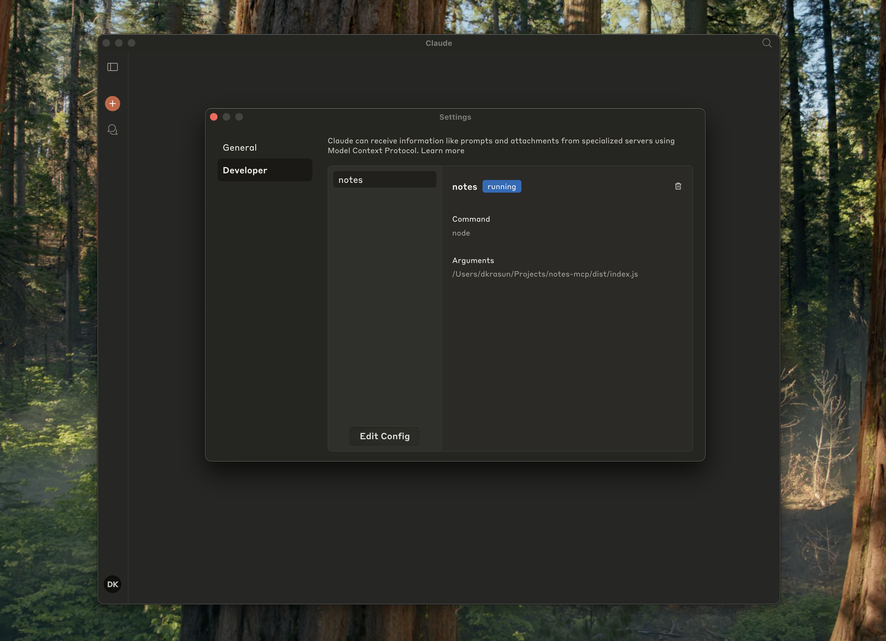
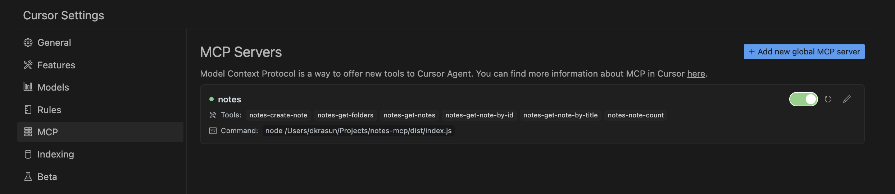

# Notes MCP

An MCP server that connects with your Apple Notes on macOS.

## Supported Tools

-   `notes-get-folders`: Get all folders.
-   `notes-get-notes`: Get all notes in a folder.
-   `notes-create-note`: Create a new note with title and content.
-   `notes-get-note-by-id`: Get a note by its identifier.
-   `notes-get-note-by-title`: Find a note by exact match of title.
-   `notes-get-note-count`: Get the total number of notes.

## Usage

### Build it

Always install dependencies and build it first:

```bash
npm install && npm run build
```

### With Claude for Desktop

Add the following to your `~/Library/Application\ Support/Claude/claude_desktop_config.json`:

```json
{
    "mcpServers": {
        "notes": {
            "command": "node",
            "args": ["path/to/notes/mcp/dist/index.js"]
        }
    }
}
```

And check it is running in Claude settings:



### With Cursor

```json
{
    "mcpServers": {
        "notes": {
            "command": "node",
            "args": ["path/to/notes/mcp/dist/index.js"]
        }
    }
}
```

And then check Cursor MCP settings:



### Standalone or for other projects

```bash
node dist/index.js
```

## License

`Notes MCP` is licensed [under the MIT License](LICENSE).
